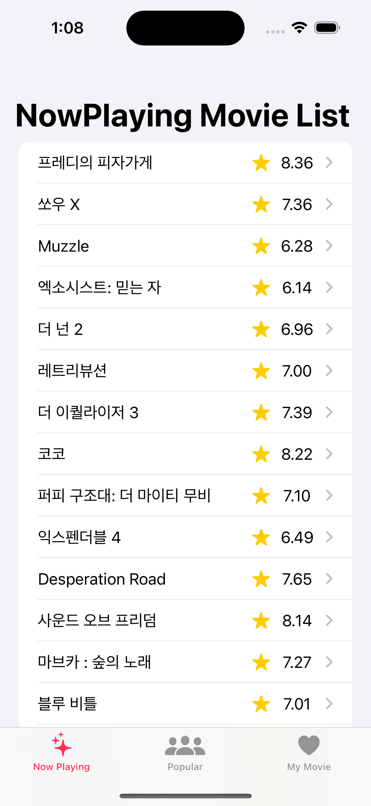

 # MovieDabang
 최신 영화 리스트와 인기있는 영화 리스트를 [TMDB API](https://developers.themoviedb.org/3/getting-started/introduction) 를 통해 불러와서 리스트로 보여줌.
 
 ## Screenshots
|  |  |  |                                                              |
| ------------------------------------------------------------ | ------------------------------------------------------------ | ------------------------------------------------------------ | ------------------------------------------------------------ |
 |  |  |  |  |
 
 ### 23.11.03 기준
 - 100% Swift
 - Async/await API
 - SwiftData 를 사용 -> iOS 17+ 
