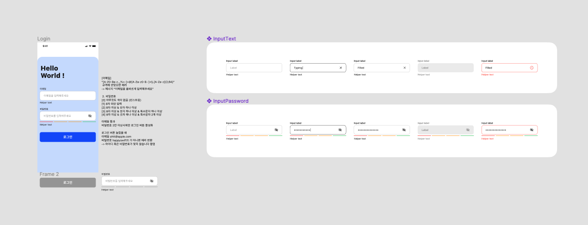
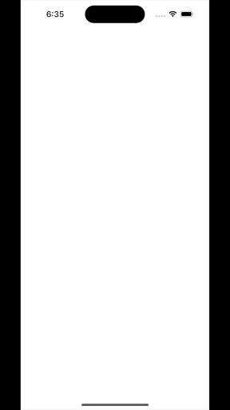

# 멘토링 과제 (10/26 ~ 10/31)
- 로그인 뷰 만들기 (뷰 + 제약 사항 지정)

## Gif
 

## 
**10 / 29 - 뷰 완성 + 로직 완성**

**10 / 31 - 1차 리펙토링**
- Observabel Object 로 구분해서, 로그인 뷰의 각 컴포넌트 분리

**11 / 01 - 피드백**
- 코드 컨벤션 ✅
    - 구조체 내부 프로퍼티 줄 띄우는 것 이랬다 저랬다 함
    - View 에서도 엔터가 있다 없다 함
    - 그 외에도 체크해보기
- 접근 제어자 체크 ✅
- Color -> 현재 방법 외에 Assets 에 만들어보기 ✅
- 빨간색으로 TextField 의 border 변화 줄까..? ❌
- background cornerradius - 상단 leading trailing 만 주도록 수정 ✅
- 외부 터치 -> keyboard 숨기기 ✅
- keyboard 올라왔을때, 로그인 화면 조정 ✅

**11 / 01 - 2차 리펙토링**

- 코드 컨벤션
    - 구조체 프로퍼티 줄띄움 X ( state 와 일반 프로퍼티 사이에 한줄 띄우기 )
    - View 에서 줄띄움 X
    - action 클로저 내부에 함수만 호출 되더라도, 중괄호 다음으로 줄 내리기
    - 옆으로 너무 길어지면 내려서 볼 수 있도록 할 것
    - 모든 새로운 구조체 에 MARK 로 가벼운 설명
    - preview 포함 구조체끼리 1줄만 띄우기
- Preview 사용 인스턴스 제외 private 설정 (함수 포함)
- 화면 터치 -> keyboard 숨기기 UIKit 방식 사용 하지 않고,
- FocusState 사용
- keyboard 가 모바일에서 실행시켜보니, 화면이 아래로 내려간..다..?
    -> 이런건 처음봐..
    -> 백그라운드, 로그인 뷰 스택 갈아엎기 계속 하다가 문제 발견
    -> GeometryReader 에서 나온 문제였다.
    -> geo 가 인터렉션과 함께 할때 오류가 있는 경우들이 있다고 한다 (자세히 모름)
    -> 그래서 일반적으로 background 화면을 그리고 그위에 .overlay { } 를 통해서 코드 작성
- Color Assets 을 추가하면서 든 생각..
    -> 나는 휴대폰을 다크모드로 쓴다.
    -> 추후에 다양한 컬러셋을 쓰는 경우, backgroundcolor 에 따른 변경이 필요할지도..?
    -> 지금은 Dark mode 를 막을까 했지만, 텍스트에 hard 하게 foreground 로 color 줬음.
    
**11 / 05 - 2차 리팩토링**
- focusstate -> enum 사용하는 방식으로 수정
    -> onSubmit 시, 다음 텍스트 필드 이동 등.
- 중복 코드 일부 수정.
